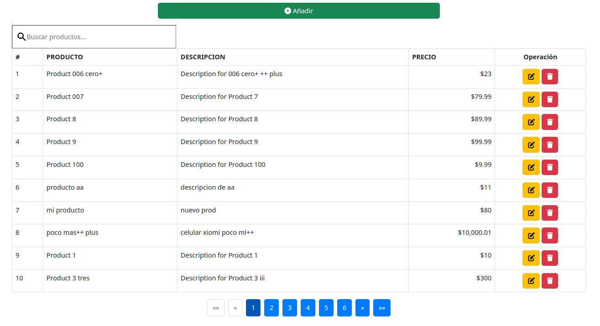
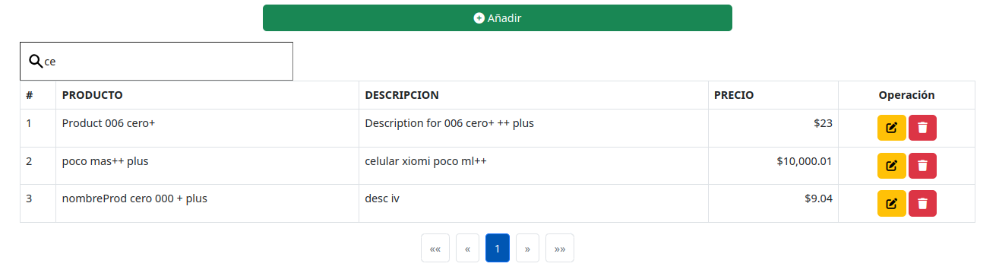
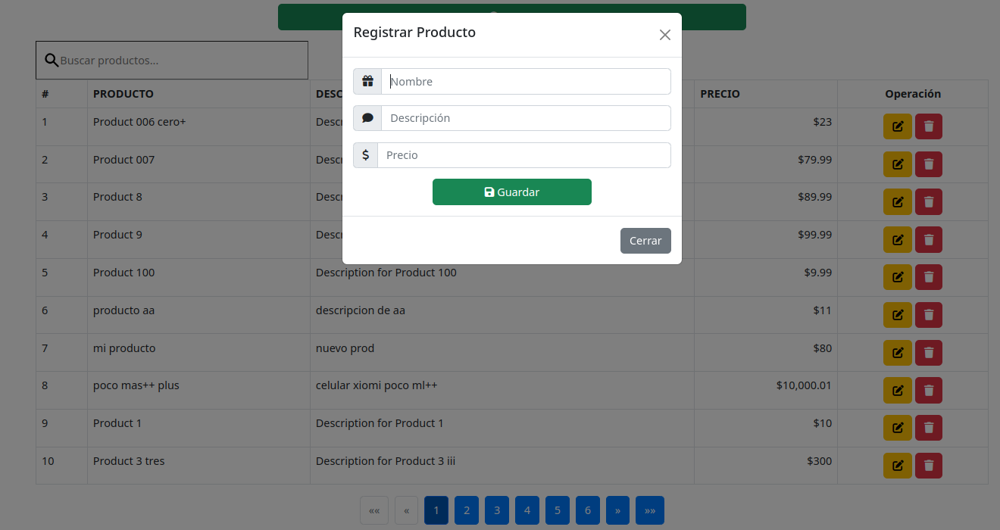
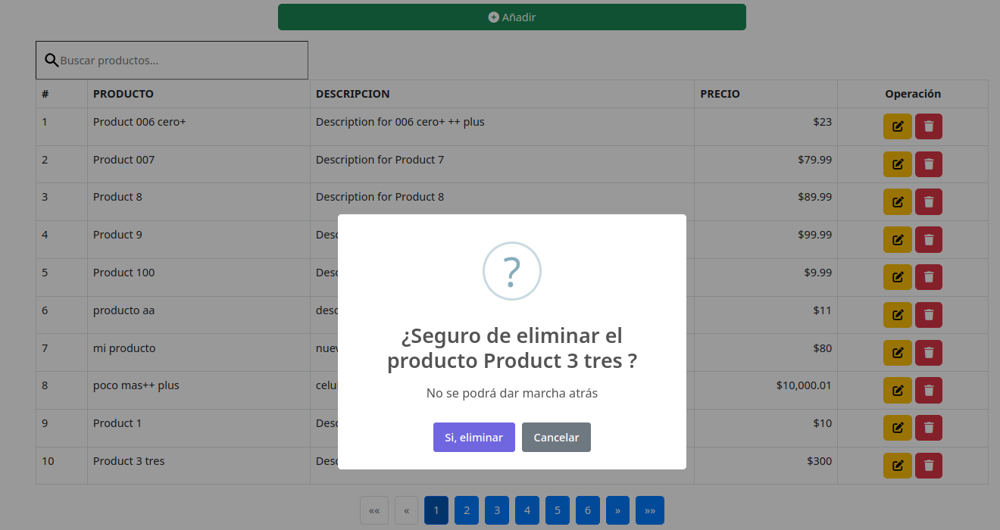

# CRUD Aplicacion sobre Producto con res api (mysql) y react 
## Operaciones: Adicion, modificacion, eliminacion y busqueda,

### Descripcion

Este proyecto implementa operaciones CRUD completas (Crear, Leer, Actualizar y Eliminar), junto con filtrado y paginación en un grid. A continuación, se describen las funcionalidades principales:

*Operaciones CRUD y Filtrado: Todas las operaciones de CRUD y filtrado son completamente funcionales.

*Grid con Filtros: El grid permite filtrar datos por todos los campos.

*Paginación: El grid incluye paginación y permite seleccionar el número de elementos por página (10, 20, etc.).

*Función de Limpiar Filtro: Se puede limpiar el filtro.

### Requisitos del Sistema

- **Sistema Operativo**: Ubuntu 20.04.4 
- **Kernel**: Version 6.2.16-3-pve
- **React**: 8.2.0 
- **NodeJS**:  10.8.2
- **npm/npx**: 10.8.4
- **Apache**:  2.4.41 (Ubuntu) server /server built 2024-07-17T18:58:09
- **PHP**: 7.4.3
- **Mysql**: 8.0.39

Sistemas Alternativos Probados

El proyecto también ha sido probado en el siguiente entorno alternativo:

- **Sistema Operativo**: Windows 10 Pro 1803
- **Angular**: 15.0.4 
- **NodeJS**:  18.20.4
- **npm/npx**: 18.20.4

# Fuente
Adecuado de https://gitlab.com/DanCruise/api-products 

Si quieres ver el video en donde se explica paso a paso como realizar ese CRUD [te comparto el siguiente enlace](https://www.youtube.com/watch?v=fgQHjMotDPk)

## Notas de instalacion
Crear la React App.

1 npm install -g create-react-app

create-react-app my-app

cd my-app

2  Instala la Rest api que esta en el directorio aprod/
Necesitas Apache, Php y mysql

3 Clonar o descargar este proyecto de https://github.com/fabinnerself/reactProdBootsHub.git

4 Ejecutar 

npm install

5 Para ejecutar

npm start

El servidor RESTful API en http://192.168.1.10/aprod tiene las siguientes características:

API REST que permite a los usuarios consultar y gestionar un catálogo de productos en línea. La API está construida con PHP, MySQL y Apache. La tabla de productos almacena información sobre el nombre, descripción, precio y otros atributos de los productos. La API admite las siguientes operaciones:

Obtener una lista de todos los productos: método GET
Crear un nuevo producto: método POST
Actualizar un producto existente: método PUT
Eliminar un producto: método DELETE

La API devuelve respuestas en formato JSON. Por ejemplo, una respuesta para obtener todos los productos podría ser:

[
  {
    "id": 1,
    "name": "Producto 1",
    "description": "Descripción del producto 1",
    "price": "10.00"
  },
  {
    "id": 2,
    "name": "Producto 2",
    "description": "Descripción del producto 2",
    "price": "20.00"
  }
]

## Imagenes

Busqueda:

Adición:

Modificación:

Eliminación:

## Comandos utiles
*Ver la versión del kernel:

uname -r

*Ver información del sistema:

sb_release -a

 